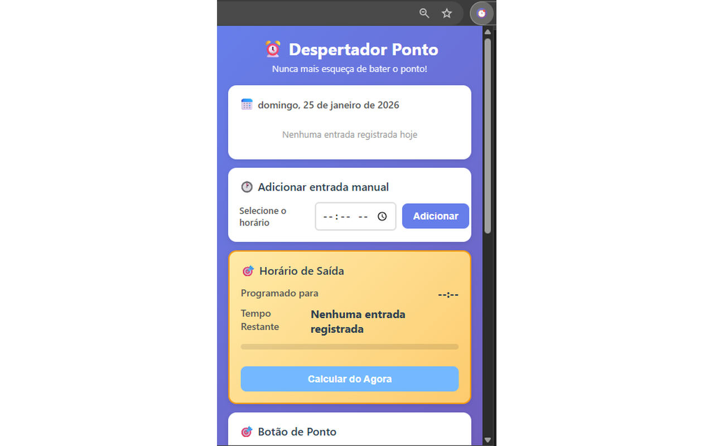
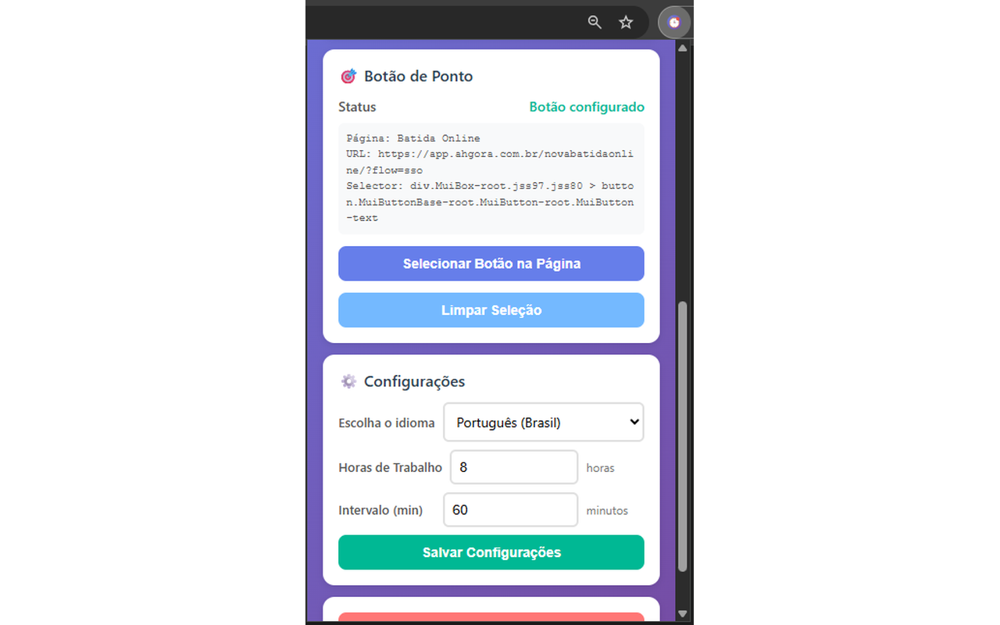
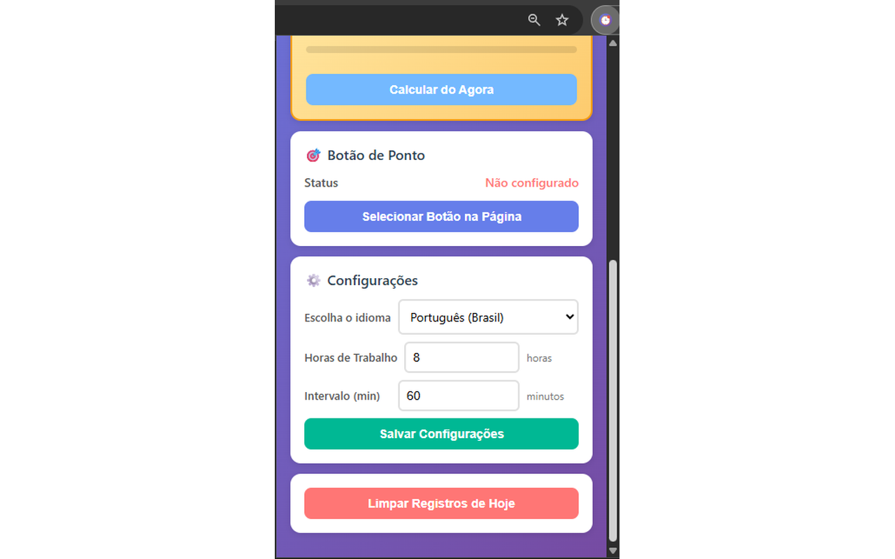

# ⏰ Despertador Ponto

Extensão para Google Chrome que funciona como um despertador para batida de ponto online em **qualquer sistema**.

## 🎯 Funcionalidades

- ✅ **Registro Automático**: Detecta automaticamente quando você bate o ponto no seu sistema
- 🎯 **Seletor Visual**: Configure o botão de ponto com apenas um clique
- ⏱️ **Múltiplas Entradas**: Suporta múltiplas marcações no mesmo dia
- 🔔 **Alertas Inteligentes**: Notificações 5min e 1min antes da hora de sair
- 📊 **Cálculo Automático**: Calcula automaticamente o horário de saída baseado na entrada
- ⚙️ **Configurável**: Defina suas horas de trabalho e tempo de intervalo
- 📝 **Entrada Manual**: Adicione registros manualmente quando necessário
- 🌐 **Universal**: Funciona em qualquer site de ponto online
- 🎨 **Interface Moderna**: Design limpo e intuitivo
- 🌍 **Multilíngue**: Suporte a Português (BR), English (US) e Español

## 📸 Screenshots

### Interface Principal

<p align="center">
  
  <br>
  <em>Popup principal com entradas registradas e horário de saída calculado</em>
</p>

### Configuração do Botão

<p align="center">
  
  <br>
  <em>Seletor visual do botão de ponto</em>
</p>

### Configurações e Idiomas

<p align="center">
  
  <br>
  <em>Configuração de horas de trabalho, intervalo e idioma</em>
</p>

## 📋 Pré-requisitos

- Google Chrome (ou navegador baseado em Chromium)
- Node.js (opcional, apenas para gerar ícones)

## 🚀 Instalação

### 📥 Da Chrome Web Store (Em Breve)

🔜 A extensão estará disponível na Chrome Web Store em breve!

### 🛠️ Para Desenvolvedores

#### Passo 1: Preparar a Extensão

1. Clone ou baixe este repositório:
```bash
git clone https://github.com/FabricioSouza88/depertador-ponto-chromeext.git
cd despertador-ponto
```

#### Passo 2: Gerar Ícones (Opcional)

A extensão precisa de ícones PNG. Você tem três opções:

**Opção A: Usando Node.js (Recomendado)**
```bash
npm install
npm run generate-icons
```

**Opção B: Converter manualmente**
- Acesse: https://cloudconvert.com/svg-to-png
- Converta `icons/icon.svg` para os tamanhos: 16x16, 32x32, 48x48, 128x128
- Salve como: `icon16.png`, `icon32.png`, `icon48.png`, `icon128.png` na pasta `icons/`

**Opção C: Usar ícones temporários**
- A extensão funcionará sem ícones, mas mostrará um ícone padrão do Chrome

#### Passo 3: Instalar no Chrome

1. Abra o Chrome e acesse: `chrome://extensions/`

2. Ative o **Modo do desenvolvedor** (canto superior direito)

3. Clique em **Carregar sem compactação**

4. Selecione a pasta do projeto `despertador-ponto`

5. A extensão será instalada e aparecerá na barra de ferramentas! 🎉

### 📦 Build para Publicação

Para gerar o arquivo ZIP e publicar na Chrome Web Store:

```powershell
# Executar script de build
.\build-extension.ps1
```

O arquivo `despertador-ponto.zip` será gerado na raiz do projeto, pronto para upload na Chrome Web Store.

### 📸 Preparar Screenshots

Para redimensionar screenshots para o padrão da Chrome Web Store (1280x800):

```bash
# Instalar dependências (primeira vez)
pip install -r requirements.txt

# Redimensionar screenshots
python resize-screenshots.py
```

Os screenshots redimensionados estarão em `/screenshots/resized`.

📚 **Documentação completa**: 
- [Guia de Build](docs/BUILD_GUIDE.md)
- [Guia de Screenshots](docs/SCREENSHOTS_GUIDE.md)
- [Textos para Chrome Web Store](docs/CHROME_STORE_LISTING.md)

## 📖 Como Usar

### 1. Configurar o Botão de Ponto (OBRIGATÓRIO)

**Primeira vez usando a extensão? Siga estes passos:**

1. Abra a página do seu sistema de ponto online
2. Clique no ícone da extensão na barra de ferramentas
3. Na seção "Botão de Ponto", clique em **"🖱️ Selecionar Botão na Página"**
4. O popup fechará e a página ficará com uma camada escura
5. Mova o mouse sobre os elementos - cada um será destacado com uma borda azul
6. **Clique no botão de ponto** que você quer monitorar
7. Uma notificação verde confirmará: "Botão configurado!" ✨

**Pronto!** A partir de agora, quando você clicar nesse botão para bater o ponto, a extensão registrará automaticamente.

### 2. Registro Automático

Depois de configurar o botão:

1. Acesse normalmente a página do seu sistema de ponto
2. Clique no botão que você configurou
3. A extensão detectará automaticamente e registrará a entrada! ✨
4. Uma notificação aparecerá confirmando o registro

### 3. Visualizar Registros

1. Clique no ícone da extensão na barra de ferramentas

2. O popup mostrará:
   - Data atual
   - Lista de todas as entradas do dia
   - Horário estimado de saída
   - Tempo restante até a saída
   - Barra de progresso

### 4. Adicionar Entrada Manual

1. Abra o popup da extensão

2. Na seção "Entrada Manual":
   - Selecione o horário
   - Clique em **Adicionar**

3. A entrada será registrada e o horário de saída recalculado

### 5. Configurar Horários

1. Abra o popup da extensão

2. Na seção "Configurações":
   - **Horas de trabalho**: Defina quantas horas você trabalha por dia (ex: 8)
   - **Intervalo**: Defina o tempo de intervalo em minutos (ex: 60)

3. Clique em **Salvar**

4. Os cálculos serão atualizados automaticamente

### 6. Notificações

A extensão enviará notificações nos seguintes momentos:

- ⏰ **5 minutos antes** do horário de saída (aviso)
- ⏰ **1 minuto antes** do horário de saída (aviso final)
- 🔔 **No horário exato** de saída (alarme principal)

Você pode:
- Clicar em "Já bati o ponto" para dispensar
- Clicar em "Lembrar em 5 min" para ser avisado novamente

### 7. Gerenciar Configuração

Para **remover** a configuração do botão:

1. Abra o popup da extensão
2. Na seção "Botão de Ponto", clique em **"Limpar Seleção"**
3. Configure novamente quando necessário

## ⚙️ Configurações

### Permissões Utilizadas

- **storage**: Para salvar registros e configurações localmente
- **alarms**: Para criar lembretes e notificações programadas
- **notifications**: Para mostrar alertas na área de notificações
- **activeTab**: Para permitir seleção do botão na aba ativa
- **scripting**: Para injetar o detector de cliques dinamicamente
- **host_permissions** (http://*/* e https://*/*): Para funcionar em qualquer site

### Estrutura do Projeto

```
despertador-ponto/
├── manifest.json          # Configuração da extensão
├── popup.html            # Interface do popup
├── popup.css             # Estilos do popup
├── popup.js              # Lógica do popup
├── content.js            # Script injetado nas páginas
├── background.js         # Service worker (alarmes)
├── package.json          # Dependências Node.js
├── icons/                # Ícones da extensão
│   ├── icon.svg
│   ├── icon16.png
│   ├── icon32.png
│   ├── icon48.png
│   └── icon128.png
├── README.md             # Este arquivo
└── docs/                 # Documentação completa
    ├── CHANGELOG.md
    ├── BUILD_GUIDE.md
    ├── CHROME_STORE_LISTING.md
    ├── SCREENSHOTS_GUIDE.md
    ├── TOOLTIP_FEATURE.md
    ├── BUTTON_SELECTOR_GUIDE.md
    ├── TEST_BUTTON_SELECTOR.md
    ├── MIGRATION_v1.2.md
    ├── DEVELOPER.md
    ├── QUICK_START.md
    └── INSTALL.txt
```

## 🛠️ Desenvolvimento

### Tecnologias Utilizadas

- **Manifest V3**: Versão mais recente das extensões Chrome
- **Chrome Storage API**: Armazenamento local
- **Chrome Alarms API**: Agendamento de notificações
- **Chrome Notifications API**: Notificações do sistema
- **Chrome Scripting API**: Injeção dinâmica de scripts
- **Content Scripts**: Integração com páginas web
- **Service Workers**: Processos em background

### Boas Práticas Implementadas

- ✅ Arquitetura modular e organizada
- ✅ Classes e métodos bem documentados
- ✅ Tratamento de erros
- ✅ Código limpo e legível
- ✅ Debounce para evitar clicks duplicados
- ✅ Feedback visual para o usuário
- ✅ Seletor CSS inteligente com fallbacks
- ✅ Verificação de URL para segurança
- ✅ Responsividade e UX moderna

### Debug e Logs

Para visualizar logs da extensão:

1. **Popup**: Clique com botão direito no popup > Inspecionar
2. **Background**: Acesse `chrome://extensions/` > Detalhes da extensão > Inspecionar visualizações
3. **Content Script**: F12 na página do seu sistema de ponto > Console

Os logs são prefixados com `[Despertador Ponto]` para fácil identificação.

## 📚 Documentação Adicional

### Para Usuários:
- **[docs/BUTTON_SELECTOR_GUIDE.md](docs/BUTTON_SELECTOR_GUIDE.md)**: Guia completo sobre o seletor de botão
- **[docs/QUICK_START.md](docs/QUICK_START.md)**: Guia rápido de instalação
- **[docs/CHANGELOG.md](docs/CHANGELOG.md)**: Histórico de versões e mudanças

### Para Desenvolvedores:
- **[docs/DEVELOPER.md](docs/DEVELOPER.md)**: Guia para desenvolvedores
- **[docs/ARCHITECTURE.md](docs/ARCHITECTURE.md)**: Arquitetura da aplicação
- **[docs/REFACTORING_PLAN.md](docs/REFACTORING_PLAN.md)**: Plano de refatoração modular
- **[README_REFACTORING.md](README_REFACTORING.md)**: Status da refatoração em andamento

### Testes e Debug:
- **[docs/TEST_BUTTON_SELECTOR.md](docs/TEST_BUTTON_SELECTOR.md)**: Plano de testes completo

### Internacionalização:
- **[docs/I18N_GUIDE.md](docs/I18N_GUIDE.md)**: Guia completo de i18n e como adicionar novos idiomas

## 🆕 Versão 1.2.0 - Mudanças Importantes

### ⚠️ Breaking Changes

- **Configuração obrigatória**: Não há mais detecção automática, você precisa configurar o botão
- **Sem hardcoding**: Removido suporte específico para qualquer sistema
- **Universal**: Funciona em qualquer site depois de configurado
- **Por página**: Botão configurado funciona apenas na página onde foi selecionado

### Migração

Se você usava a versão anterior, veja [docs/MIGRATION_v1.2.md](docs/MIGRATION_v1.2.md) para instruções detalhadas.

## 📝 Funcionalidades Futuras

Ideias para próximas versões:

- [ ] Histórico de registros dos últimos 30 dias
- [ ] Exportar relatório em CSV/PDF
- [ ] Integração com Google Calendar
- [ ] Múltiplos botões configurados (um por domínio)
- [ ] Estatísticas de horas trabalhadas
- [ ] Dark mode
- [ ] Sincronização entre dispositivos
- [ ] Sons personalizados para notificações
- [ ] Editor manual de CSS selector

## 🤝 Contribuindo

Contribuições são bem-vindas! Sinta-se livre para:

1. Fazer um Fork do projeto
2. Criar uma branch para sua feature (`git checkout -b feature/MinhaFeature`)
3. Commit suas mudanças (`git commit -m 'Adiciona MinhaFeature'`)
4. Push para a branch (`git push origin feature/MinhaFeature`)
5. Abrir um Pull Request

## 📄 Licença

Este projeto está sob a licença MIT. Veja o arquivo `LICENSE` para mais detalhes.

## 👨‍💻 Autor

Desenvolvido com ❤️ para facilitar o controle de ponto online.

## 🙏 Agradecimentos

- Chrome Extensions documentation
- Comunidade open source
- Todos os testadores e contribuidores

---

**⚠️ Aviso**: Esta é uma extensão não oficial e não tem vínculo com nenhum sistema de ponto eletrônico. Use por sua conta e risco.

**💡 Dica**: Não esqueça de dar uma ⭐ no projeto se ele foi útil para você!

**📖 Leia**: [docs/BUTTON_SELECTOR_GUIDE.md](docs/BUTTON_SELECTOR_GUIDE.md) para entender como funciona o seletor de botão.
